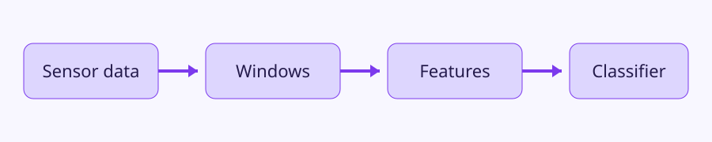

# Slide 1 - The classification pipeline

Raw sensor readings are divided into windows. Features are extracted from each window. A trained classifier predicts an activity label.

# Slide 2 - Why windows overlap

An activity transition can fall near a window boundary. Overlap reduces the chance that a short event is missed, but it produces more samples and increases computation.

# Slide 3 - Evaluation warning

Windows from the same person are correlated. A random window-level split can leak person-specific patterns into the test set. Prefer a subject-level split when measuring generalization to unseen people.
