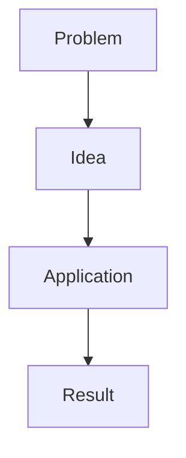

# Obsidian Formatting

## Markdown baseline

Produce CommonMark-compatible Markdown plus intentional Obsidian extensions. Keep heading levels hierarchical and avoid skipping levels without a reason. Preserve existing YAML frontmatter when repairing a note unless the user requests a change.

Do not use semicolons in generated prose when the active profile forbids or avoids them. Do not replace semicolons required by code, URLs, entities, or formal syntax. Prefer the ASCII hyphen `-` over em dashes in generated prose when the profile requests it.

## Callouts

Use valid Obsidian callout syntax:

```markdown
> [!note] Why this matters
> The explanation belongs here.
```

Useful types include `abstract`, `note`, `info`, `tip`, `example`, `question`, `warning`, `danger`, `failure`, and `success`. Select the type for its semantic role. Callouts should surface information that benefits from separation, not wrap ordinary paragraphs for decoration.

Never use `==highlight==` inside a callout because the callout already provides visual emphasis. When a particular sentence or phrase still needs emphasis, use `**bold**` selectively. Do not automatically bold the entire callout body, and leave ordinary callout text unformatted when its container is sufficient. Continue using `==highlight==` selectively for central insights in normal prose outside callouts.

Render the final one-sentence takeaway as one compact summary callout at the end of the note unless the user requests another structure:

```markdown
> [!summary] One-sentence takeaway
> **A concise sentence that states the note's central insight.**
```

Use the callout title as the section label, without a separate heading immediately before it. Bold the takeaway sentence, keep it genuinely concise, and state the central insight rather than repeating the title. Never use highlight markup inside this callout.

Nested or foldable callouts are optional. Preserve custom callout identifiers in existing notes.

## Mermaid

Use Mermaid when relationships, sequence, state, hierarchy, or branching become clearer visually. Do not add a diagram that merely repeats a short list.

Keep diagrams compact, labels short, and direction suited to the content. Resolve direction independently for each diagram from its own explanatory labels, not from the note language, profile, or frontmatter. Mermaid keywords, identifiers, arrows, and code structure remain left-to-right syntax even when labels are RTL.

First decide whether the relationship fits a horizontal layout. Use `RL` for a horizontal diagram whose dominant explanatory language is RTL, including Hebrew, Arabic, Persian, and Urdu. Use `LR` for an LTR diagram, including an English diagram inside an RTL note. A note may validly contain both directions. For intentionally reversed LTR flow, add the valid Mermaid comment `%% direction: intentional`. When mixed-language direction is ambiguous, either add diagram-level metadata such as `%% language: he`, `%% language: en`, `%% language: rtl`, or `%% language: ltr`, or prefer a vertical layout rather than guessing.

Use `TD` or `TB` when a horizontal diagram would require excessive scrolling, create too many visual columns, contain many sequential stages or wide labels, fan into many branches, or combine branching with long explanations. Optimize for readability in a typical Obsidian note pane rather than minimizing height. Compact horizontal comparisons and short processes may remain horizontal.



Avoid HTML labels, fragile styling, and unverified syntax. Use a table or prose if the target Obsidian setup cannot render the required diagram reliably.

## Horizontal rules

In a long note, use a Markdown horizontal rule (`---`) when one substantial conceptual unit has ended and a meaningfully different family of ideas, phase, perspective, or problem domain begins. The profile value `between_major_topics` requests this semantic use of section dividers. Several closely related subsections may form one unit before a divider.

Do not place a rule after every heading, between closely related subsections, merely because a section is long, immediately after YAML frontmatter as decoration, or at the end of the note. Never place one inside a list, table, callout, code fence, or Mermaid block, and never emit consecutive rules. Use dividers sparingly enough that the narrative remains continuous.

## LaTeX

Use `$...$` for short inline math and `$$...$$` for display math. Keep natural-language explanations outside the formula. Any natural-language text inside math must be English, in inline and display math and in every text-bearing command, including nested commands. This constraint has no request or renderer exception in this version of the skill.

Do not interpret this as an ASCII-only rule. Mathematical symbols such as `α`, `β`, and `∑`, variables, numbers, and valid commands such as `\frac` are allowed. The checker detects selected non-Latin linguistic scripts in math, including multiline and nested content. It does not reliably identify Latin-script non-English words or distinguish every ambiguous Unicode use. Review all text-bearing LaTeX commands qualitatively.

After a formula, explain:

- What each symbol means
- The relevant assumptions
- How to read the result
- A small example when useful

Do not place Markdown emphasis inside math delimiters.

## Tables

Use tables for exact comparison or repeated fields. Give every column a distinct header. Keep cells concise and move long explanations below the table. Avoid tables so wide that they become difficult to read in the Obsidian editor.

Escape literal pipe characters inside cells. Verify that every row has the same number of cells.

## Images and embeds

Prefer images from the provided source when they contribute evidence or understanding. Extract only images that can be accessed faithfully. Use descriptive filenames and relative embeds, for example:

```markdown
![[assets/images/chapter-04-attention-architecture.png]]
```

or standard Markdown when requested:

```markdown

```

Add a caption or explanation that says what the reader should notice. Do not add book covers, decorative stock images, or unrelated illustrations to chapter notes. Do not invent a local path when no image was saved.

## Links and existing notes

Preserve meaningful `[[wikilinks]]`, aliases, block references, embeds, tags, footnotes, and link targets when repairing a note. Correct a link only when its intended target is evident. Do not create a MOC or add backlinks to other notes without an explicit request.
