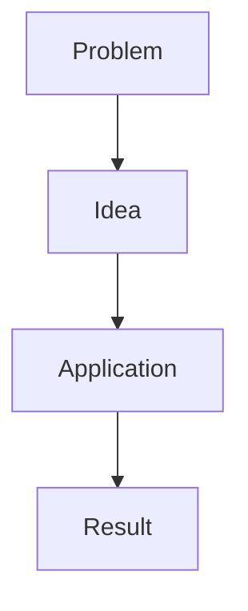

# Obsidian Formatting

## Markdown baseline

Produce CommonMark-compatible Markdown plus intentional Obsidian extensions. Keep heading levels hierarchical and avoid skipping levels without a reason. Preserve existing YAML frontmatter when repairing a note unless the user requests a change.

Do not use semicolons in generated prose when the active profile forbids or avoids them. Do not replace semicolons required by code, URLs, entities, or formal syntax. Prefer the ASCII hyphen `-` over em dashes in generated prose when the profile requests it.

## Callouts

Use valid Obsidian callout syntax:

```markdown
> [!note] Why this matters
> The explanation belongs here.
```

Useful types include `abstract`, `note`, `info`, `tip`, `example`, `question`, `warning`, `danger`, `failure`, and `success`. Select the type for its semantic role. Callouts should surface information that benefits from separation, not wrap ordinary paragraphs for decoration.

Nested or foldable callouts are optional. Preserve custom callout identifiers in existing notes.

## Mermaid

Use Mermaid when relationships, sequence, state, hierarchy, or branching become clearer visually. Do not add a diagram that merely repeats a short list.

Keep diagrams compact, labels short, and direction suited to the content. In RTL notes, labels may use the output language, but Mermaid keywords and identifiers must remain valid. Explain the diagram before or after it so the reader knows what relationship to inspect.



Avoid HTML labels, fragile styling, and unverified syntax. Use a table or prose if the target Obsidian setup cannot render the required diagram reliably.

## LaTeX

Use `$...$` for short inline math and `$$...$$` for display math. Keep natural-language explanations outside the formula. Text inside `\text{...}` or similar commands must be English, even when the surrounding note is RTL, unless the user explicitly overrides this constraint and their renderer is known to support it.

After a formula, explain:

- What each symbol means
- The relevant assumptions
- How to read the result
- A small example when useful

Do not place Markdown emphasis inside math delimiters.

## Tables

Use tables for exact comparison or repeated fields. Give every column a distinct header. Keep cells concise and move long explanations below the table. Avoid tables so wide that they become difficult to read in the Obsidian editor.

Escape literal pipe characters inside cells. Verify that every row has the same number of cells.

## Images and embeds

Prefer images from the provided source when they contribute evidence or understanding. Extract only images that can be accessed faithfully. Use descriptive filenames and relative embeds, for example:

```markdown
![[assets/chapter-04-attention-architecture.png]]
```

or standard Markdown when requested:

```markdown

```

Add a caption or explanation that says what the reader should notice. Do not add book covers, decorative stock images, or unrelated illustrations to chapter notes. Do not invent a local path when no image was saved.

## Links and existing notes

Preserve meaningful `[[wikilinks]]`, aliases, block references, embeds, tags, footnotes, and link targets when repairing a note. Correct a link only when its intended target is evident. Do not create a MOC or add backlinks to other notes without an explicit request.
